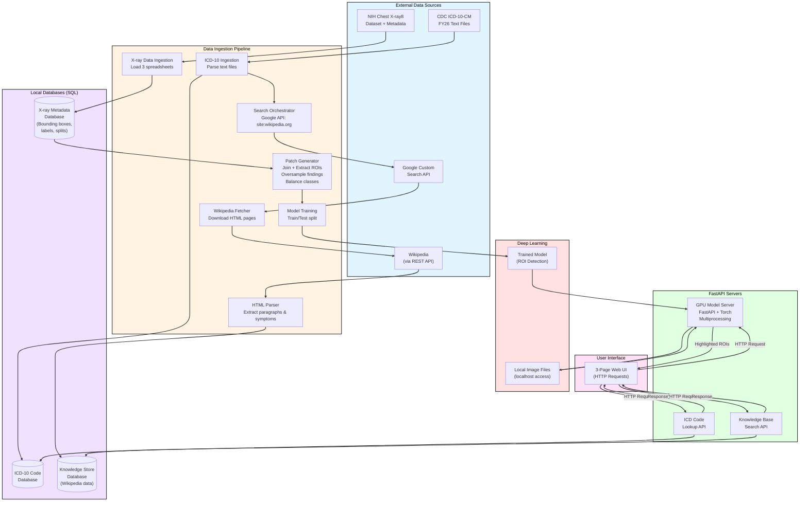

# HealthCareDataRef 
Click on any section of the table of contents to jump to that section. 
## Table of Contents
1. [Overview](#overview)
2. [Repo map](#repo-map)
3. [System Block Diagram](#system-block-diagram)
4. [Copyright information and data attribution](#copyright-information-and-data-attribution)
5. [Data set notes](#data-set-notes)
6. [Database Search Tools](#database-search-tools)

# Overview
The health care system uses coded short descriptions of visits, diagnoses, and treatments. Coding minimizes the information stored and makes the text normalized and searchable for large-scale data systems. International Classification of Diseases (ICD) codes standardize the records. In the US, the CDC publishes codes annually. ICD databases are directories of codes, tables, and descriptions, with PDFs, TXT, and XML files. It's a lot to dig through. Parsing the ICD documentation into searchable databases is advantageous for both automated and human-in-the-loop systems.

When someone is admitted to the hospital or a clinic, they have a chief complaint. There's some med recon, triage, and so on. Ultimately the doctor assigns a diagnosis that fits the observations and tests. A report has to be generated that has the diagnosis code, along with the procedure codes. Health insurance companies take the reports and check to see if the patient's policy covers everything. Because of the specificity of some of the codes, my guess is that some of these impact law enforcement and legal proceedings too.

This repo is a demo that implements the following tools that could be useful for finding correct ICD codes and extracting information from imaging data:

1. UI to make requests to API servers. 
2. ICD code look up.
3. Ingestion to keep databases up to date.
4. Knowledge base search.
5. LLM calls.
6. Deep learning tools including, data set curation, model training, and a GPU model server.

# Repo map

```text
HealthCareDataRef/
├── app/
│   ├── ui.py                         # PyQt6 desktop UI entrypoint
│   ├── run_app.sh                    # Orchestrates local services + UI startup
│   ├── services/
│   │   ├── icd10_dbsearch.py          # ICD-10 query service
│   │   ├── image_model_server.py      # CV model inference service
│   │   └── knowledge_store_search.py  # Knowledge-base search API
│   └── utils/
│       └── model_serve_tools.py       # Post-inference utilities (heatmaps, aggregation)
│
├── jobs/
│   ├── dbsettools/                      # Database ingestion & enrichment jobs
│   │   ├── parse_icd10.py             # Parse official ICD-10 releases
│   │   ├── parse_mimic.py             # Parse MIMIC clinical dataset
│   │   ├── save_wikipedia_pages.py    # Fetch & cache Wikipedia source pages
│   │   ├── movestuff.sh               # Atomic promote of staged Wikipedia data
│   │   ├── entrypoint.sh              # Defines execution order for DB jobs
│   │   └── parse_wikipedia_pages.py   # Extract structured medical entities
│   │
│   └── dltools/                       # Deep-learning training workflows
│       ├── chestxray8/                # ChestXray-8 CV training & analysis
│       │   ├── BaseDataManager.py     # Dataset indexing, splits, metadata I/O
│       │   ├── network.py             # Model definitions (ResNet, heads)
│       │   ├── fineTuneResNet.py      # Supervised + transfer-learning training
│       │   ├── analyze_img.py         # Patch-level inference & visualization
│       │   ├── refactor_analyze_img.py# Refactored inference pipeline (WIP)
│       │   ├── Patch_maker.py         # Patch extraction & coordinate mapping
│       │   ├── patch_gen_thought.py   # Design notes on patch strategy
│       │   └── note.txt               # Experiment notes & observations
│       │
│       ├── gpt2_keywords/             # (Planned) LLM fine-tuning for keyword generation
│       └── chemistry_models/          # (Planned) Molecular / structure learning
│
├── models/                           # Trained model artifacts (local / cached)
├── config/                           # Environment & runtime configuration
├── tests/                            # Unit & integration tests
├── requirements_torch.txt            # pip install requirements for the enviornment
└── README.md
```

# System Block Diagram



# Copyright information and data attribution
## Wikipedia page text
Wikipedia page text is under a creative commons licence[1-3]. 

Wikipedia REST API requests use this format [4]:
	
	https://en.wikipedia.org/api/rest_v1/page/html/page_name

Wikipedia page titles use this format 
	
	https://en.wikipedia.org/wiki/page_name

1. https://en.wikipedia.org/wiki/Wikipedia:Copyrights
2. https://en.wikipedia.org/wiki/Wikipedia:Text_of_the_Creative_Commons_Attribution-ShareAlike_4.0_International_License
3. https://en.wikipedia.org/wiki/Wikipedia:Text_of_the_GNU_Free_Documentation_License
4. https://en.wikipedia.org/wiki/Special:RestSandbox/wmf-restbase

## Physionet Mimic-IV Demo

1. https://physionet.org/content/mimic-iv-ed-demo/2.2/ed/#files-panel
2. https://mimic.mit.edu/
3. https://physionet.org/content/mimic-iv-ed-demo/view-license/2.2/
4. Johnson, A., Bulgarelli, L., Pollard, T., Celi, L. A., Horng, S., & Mark, R. (2023). MIMIC-IV-ED Demo (version 2.2). PhysioNet. RRID:SCR_007345. https://doi.org/10.13026/jzz5-vs76
5. Goldberger, A., Amaral, L., Glass, L., Hausdorff, J., Ivanov, P. C., Mark, R., ... & Stanley, H. E. (2000). PhysioBank, PhysioToolkit, and PhysioNet: Components of a new research resource for complex physiologic signals. Circulation [Online]. 101 (23), pp. e215–e220. RRID:SCR_007345. 

## NIH Chest X-Ray8
NIH Chest X-Ray .png files are hosted on Kaggle under a Creative Commons license. See [1-3] for the links and the paper citation.
1. https://www.kaggle.com/datasets/nih-chest-xrays/data
2. https://creativecommons.org/publicdomain/zero/1.0/
3. Paper: Wang X, Peng Y, Lu L, Lu Z, Bagheri M, Summers RM. ChestX-ray8: Hospital-scale Chest X-ray Database and Benchmarks on Weakly-Supervised Classification and Localization of Common Thorax Diseases. IEEE CVPR 2017, ChestX-ray8_Hospital-Scale_Chest_CVPR_2017_paper.pdf

## CDC ICD10 data 
ICD-10-CM codes are U.S. government works in the public domain. ICD-10 website ciste CDC National Center for Health Statistics (NCHS) as a content source.

1. https://www.cdc.gov/nchs/icd/icd-10-cm/files.html


# Data set notes
While the data is not hosted in this repo, here are some notes from working with the data. 
## CDC ICD Codes
### ICD-10-CM
CDC has the ICD codes that update annually. 
https://www.cdc.gov/nchs/icd/icd-10-cm/files.html
icd10cm-Code Descriptions-2026

Thoughts about the code structure. Thinking about code generation and token usage... databse search 
with keyword genration might help -- but already the long Descriptions match search terms pretty well.. 
likely SQL for code look up. Now symptom discussion and chart analysis from the MIMIC data set -- 
now you're talking about document sumarization, but im pretty sure you cant put PHI into the LLM 
APIs..... the MIMIC data demo is fin though per the data use policy. 

"" = same as above
__diagnosis codes__

3-7 characters in length 
1. Letter designates a chapter/category 
2. number forms general category
3. ""
4. alphanumeric (specificity like anatomical site or cause)
5. ""
6. ""
7. Letter or number provides qualification like type of encounter or fracture nature -- X used as a placeholder when 7th Char is required but earlier chars ar not

For a granular collection of networks you really want .

1. Letter, 26 possible values -> [0-25] 
2-3. number 100 possible values -> [0-99]
4-6. Alphanumeric - so this is 10 + 26 = 36^3 positions = 46,656 (naiive estimate) -> [0-46655] 
7. Letter or number -> 26+10 = 36 possible values [0-35]. 

Some codes are not likely  V97.33XD -- sucked into a jet engine, subsequent encounter -- low representation in data set. Some codes are invalid  -- J18.9 (Punemonia, unspecified organism). Some of these things, you need imaging to confirm. Some combinations are invalid by medical definition... 

LLMs have fixed token ranges - depending on what tokens are used in the input dictionary - 2-4 characters. check model card for this. 
GPT5 context window is 400k tokens (272k input + 128k output)
GPT5 vocabulary is unspecified but estimated at 50k tokens (on average its about 4 chars)
Tokens include non alphanumeric characters.

Output is only alphanumeric -> you can use bigrams -> 32^2 = 1296 vocabulary size on the output. 
Add a start and stop token and thats 38^2 = 1444 vocab size. so instead of a transformer with 50k vocabsize in and 50k out, you could do 50k in and 1444 out -> this gives a drastic reduction in the number of parameters. 

Split the context, input and output sequences like this
full context = Notes, Full output = V97.33XD (unlikely code)

| Sample ID | Context                  | Input    | Output |
|-----------|--------------------------|----------|--------|
| 0         | Notes                    | `[Start]`| V9     |
| 1         | Notes`[Start]`           | V9       | 73     |
| 2         | Notes`[Start]`V9         | 73       | 3X     |
| 3         | Notes`[Start]`V973       | 3X       | D\0    |
| 4         | Notes`[Start]`V9733X     | D\0      | \0\0   |
| 5         | Notes`[Start]`V9733XD\0  | \0\0     | \0\0   |


Then you pick some start token, and \0\0 is the end token 
\0 is a null char. then build a tokenizer script based on this. pad the context. 
select context window length based on mean + 2 standard deviations of the max note length. 
### Cancer codes
Codes fall within the C00-C97 range for malignant neoplasms (Cancers) ICD-10-CM -- ie some codes group 
* COO - C97 : general range for all malignant neoplasms
* C00 - C75 : primary cancers of specific sites (C15-C26 for digestive organs, C50 for breast)
* C76 - C80 :  
### Doctor note formats
Another key thing. Doctors have note formats

SOAP - Gold standard -- Subjective, Objective, Assessment, Plan

BIRP - Popular in mental health, Behavior, Intervention, Response, Plan

Cheif Complaint - More concise, focusing on the main reason for the visit
### ICD-10-PCS 
__inpatient procedure codes__

* Exactly 7 alphanumeric characters
* each character is an axis of classification, representing specific details about the procedure  (body part, approach, device used)

ok. so this one is easier it has 
### CPT 
__outpatient procedures/services__

* generally 5 numeric characters
* may require addition of 2 character modifiers to provide extra information about the procedure. 

So say you have some amount of data, images, patient notes, doctors notes, etc. Your job is to find a transform that takes that data as an input, then outputs the text code of interest.... 


## MIMIC-IV Demo
Notes on mimic files. 
1. Diganosis - contains both ICD-9 and ICD-10 codes
2. edstays - deidentification scrambles the date, but leaves the time. has check in, leave, and demographic info 
3. medrecon
4. pyxis -> medication dispenser information. so time that a medication was administered to the patient.
5. triage
6. vitalsign - blood pressure, heart rate, oxygenation, ecg rhythms etc. 
This data set uses ICD-9 codes as a teaching example, but there should be a conversion sheet somewhere to get the ICD10 codes. 

## NIH Chest X-Ray8
Contains 14 classifications of chest pathologies. Labels are applied using natural language processing to extract findings and meta data from the imaging study reports. 

BBox_List_2017.csv has bounding boxes for a small subset of the whole data set. The paper recommends the bounding boxes for weakly supervised tasks. There are some challenges in precise localization of findings. 

Data_Entry_2017.csv has tags for "no findings" and the other 13 classes. Full 112k metadataset for the images. 

~86k filenames included in the train_val_list.txt. the rest are in the test_list. 


# Database search tools
Find a code .com --> huge knowledge base for this stuff. you can enter decriptions, the ICD code, symptoms

https://www.findacode.com/icd-10-cm

CMS.gov  has the present on admission codes (POA)
https://www.cms.gov/medicare/payment/fee-for-service-providers/hospital-aquired-conditions-hac/coding

Look into UB-04/837 claim structure 
encounter_id
patient_id
diagnosis_seq_number
diagnosis_code
diagnosis_code_system (ICD-10-CM vs ICD-9)
diagnosis_description
diagnosis_type
poa_indicator
poa_required_flag
diagnosis_date

## findacode.com notes
findacode.com  has the documentation + the Dorlands illustrated dictionary. subscribers can add their own notes

Find a code also has a test name
acquired hemolyptic anemia -- ICD-10-CM codes and diagnostic testing/screening initial testing...

## Google search specials 
Useful for formatting search terms in google search. 

https://support.google.com/websearch/answer/2466433?hl=en

search only within a site
	site: sitename query
	sites https://pubchem.ncbi.nlm.nih.gov Ceftazidime

OR -> find results that includes either term

hashtag -> find popular hashtags on social media

() ->  groups multiple search terms to control order of ops

.. -> search within a specific range of numbers  Guitar $100..$200

""  get the exact phrase. 

asterisk -> wild card 

minus sign --> will do word 1 not word too. so like 

	Jaguar -car
	Jaguar -feline

one gives the cat, the other gives the car. 