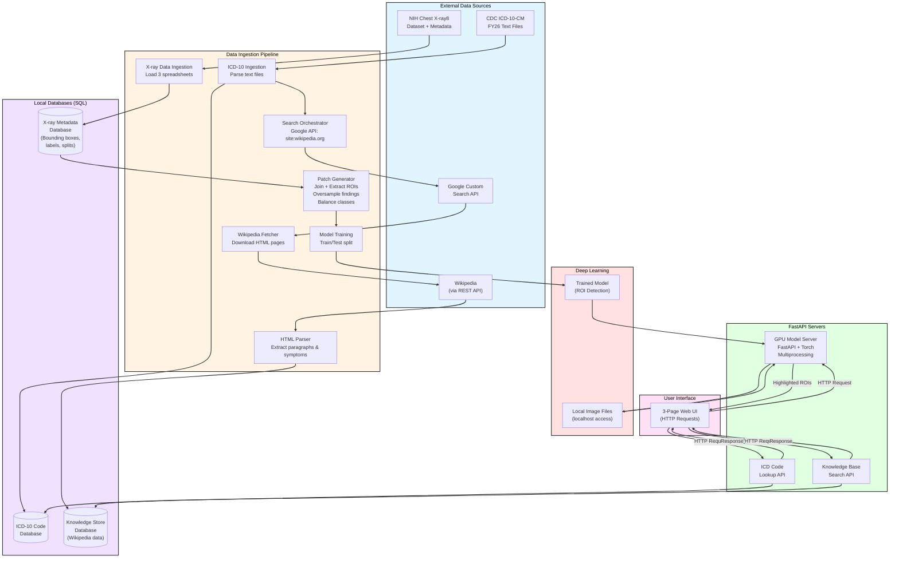

# HealthCareDataRef 

## Table of Contents
1. [Overview](#Overview)
4. [Chest X-ray Database](#chest-x-ray-database)
5. [Medical Coding Systems](#medical-coding-systems)
6. [Database Search Tools](#database-search-tools)
7. [Other Thoughts](#other-thoughts)
10. [Copyright information and data attribution](#copyright-information-and-data-attribution)
3. [TODO](#TODO)

# Overview
The health care system uses coded short descriptions of visits, diagnoses, and treatments. Coding minimizes the information stored and makes the text normalized and searchable for large-scale data systems. International Classification of Diseases (ICD) codes standardize the records. In the US, the CDC publishes codes annually. ICD databases are directories of codes, tables, and descriptions, with PDFs, TXT, and XML files. It's a lot to dig through. Parsing the ICD documentation into searchable databases is advantageous for both automated and human-in-the-loop systems.

When someone is admitted to the hospital or a clinic, they have a chief complaint. There's some med recon, triage, and so on. Ultimately the doctor assigns a diagnosis that fits the observations and tests. A report has to be generated that has the diagnosis code, along with the procedure codes. Health insurance companies take the reports and check to see if the patient's policy covers everything. Because of the specificity of some of the codes, my guess is that some of these impact law enforcement and legal proceedings too.

This repo is a demo that implements the following tools that could be useful for finding correct ICD codes and extracting information from imaging data:

1. UI to make requests to API servers. 
2. ICD code look up.
3. Ingestion to keep databases up to date.
4. Knowledge base search.
5. LLM calls.
6. Deep learning tools including, data set curation, model training, and a GPU model server.

## Block Diagram of System
block diagram



## Repo map
```text
HealthCareDataRef/
├── app/
│   ├── ui.py                         # PyQt6 desktop UI entrypoint
│   ├── run_app.sh                    # Orchestrates local services + UI startup
│   ├── services/
│   │   ├── icd10_dbsearch.py          # ICD-10 query service
│   │   ├── image_model_server.py      # CV model inference service
│   │   └── knowledge_store_search.py  # Knowledge-base search API
│   └── utils/
│       └── model_serve_tools.py       # Post-inference utilities (heatmaps, aggregation)
│
├── jobs/
│   ├── dbsettools/                      # Database ingestion & enrichment jobs
│   │   ├── parse_icd10.py             # Parse official ICD-10 releases
│   │   ├── parse_mimic.py             # Parse MIMIC clinical dataset
│   │   ├── save_wikipedia_pages.py    # Fetch & cache Wikipedia source pages
│   │   ├── movestuff.sh               # Atomic promote of staged Wikipedia data
│   │   ├── entrypoint.sh              # Defines execution order for DB jobs
│   │   └── parse_wikipedia_pages.py   # Extract structured medical entities
│   │
│   └── dltools/                      # Deep-learning training workflows
│       ├── chestxray8/               # ChestXray-8 CV training & analysis
│       │   ├── BaseDataManager.py     # Dataset indexing, splits, metadata I/O
│       │   ├── network.py             # Model definitions (ResNet, heads)
│       │   ├── fineTuneResNet.py      # Supervised + transfer-learning training
│       │   ├── analyze_img.py         # Patch-level inference & visualization
│       │   ├── refactor_analyze_img.py# Refactored inference pipeline (WIP)
│       │   ├── Patch_maker.py         # Patch extraction & coordinate mapping
│       │   ├── patch_gen_thought.py   # Design notes on patch strategy
│       │   └── note.txt               # Experiment notes & observations
│       │
│       ├── gpt2_keywords/             # (Planned) LLM fine-tuning for keyword generation
│       └── chemistry_models/          # (Planned) Molecular / structure learning
│
├── models/                           # Trained model artifacts (local / cached)
├── config/                           # Environment & runtime configuration
├── tests/                            # Unit & integration tests
├── requirements_torch.txt            # pip install requirements for the enviornment
└── README.md
```
It's in the run_app.sh but use this to kill threads on ports you know  

	kill $(sudo lsof -t -i :<PORT>)

# Copyright information and data attribution
## Wikipedia page text
Wikipedia page text is under a creative commons licence[1-3]. 

Wikipedia REST API requests use this format [4]:
	
	https://en.wikipedia.org/api/rest_v1/page/html/page_name

Wikipedia page titles use this format 
	
	https://en.wikipedia.org/wiki/page_name

1. https://en.wikipedia.org/wiki/Wikipedia:Copyrights
2. https://en.wikipedia.org/wiki/Wikipedia:Text_of_the_Creative_Commons_Attribution-ShareAlike_4.0_International_License
3. https://en.wikipedia.org/wiki/Wikipedia:Text_of_the_GNU_Free_Documentation_License
4. https://en.wikipedia.org/wiki/Special:RestSandbox/wmf-restbase

## Physionet Mimic-IV Demo

1. https://physionet.org/content/mimic-iv-ed-demo/2.2/ed/#files-panel
2. https://mimic.mit.edu/
3. https://physionet.org/content/mimic-iv-ed-demo/view-license/2.2/
4. Johnson, A., Bulgarelli, L., Pollard, T., Celi, L. A., Horng, S., & Mark, R. (2023). MIMIC-IV-ED Demo (version 2.2). PhysioNet. RRID:SCR_007345. https://doi.org/10.13026/jzz5-vs76
5. Goldberger, A., Amaral, L., Glass, L., Hausdorff, J., Ivanov, P. C., Mark, R., ... & Stanley, H. E. (2000). PhysioBank, PhysioToolkit, and PhysioNet: Components of a new research resource for complex physiologic signals. Circulation [Online]. 101 (23), pp. e215–e220. RRID:SCR_007345. 

## NIH Chest X-Ray8
NIH Chest X-Ray .png files are hosted on Kaggle under a Creative Commons license. See [1-3] for the links and the paper citation.
1. https://www.kaggle.com/datasets/nih-chest-xrays/data
2. https://creativecommons.org/publicdomain/zero/1.0/
3. Paper: Wang X, Peng Y, Lu L, Lu Z, Bagheri M, Summers RM. ChestX-ray8: Hospital-scale Chest X-ray Database and Benchmarks on Weakly-Supervised Classification and Localization of Common Thorax Diseases. IEEE CVPR 2017, ChestX-ray8_Hospital-Scale_Chest_CVPR_2017_paper.pdf

## CDC ICD10 data 
ICD-10-CM codes are U.S. government works in the public domain. ICD-10 website ciste CDC National Center for Health Statistics (NCHS) as a content source.

1. https://www.cdc.gov/nchs/icd/icd-10-cm/files.html


# TODO
Polish the readme even further to make this super followable. 

0. look into implementing encryption / hashing for requests. HIPAA compliance and privacy features.
1. train a better model. right now model was trained with 1 layer added to resnet 50. would be better to unfreeze last conv layer - go fully convoltuional at run time. 
2. Train a variant using Nt-xent loss under jobs/dltools/network.py


3. Add buttons on the icd10 code search page so that you dont have to physically type "code [first 3 chars of code]" or  "terms [space separated search terms]"

## other notes
### jobs/dbsettools
1. parseMimic.py: reads data from MIMIC IV demo version available on physionet. it's covered in their data use policy. all the records are anonymized and suitable for use in demos like this. 
2. parseICD10.py: reads ICD10 order text file and populates an sqlite database. 
3. save_wikipidia_pages.py: check documentation on google custom search engine and search api. This script reads the ICD10 db, then uses the condition names in that database as part of google searches. the google search api yields a json with links from their search engine. it's limited to 100 requests per day on the free tier. The script then uses the wikipedia REST api to save the wikipedia html given the page found in the google search. so this script will save the search result json and the wikipedia page html. -- note, text on wikipedia is under a creative commons licence. 
4. parse_wikipedia_pages.py : reads the wikipedia pages with beautiul soup along with the google search terms, and puts everything into a second sql database. Includes: google_term, wikipedia page title, description(first paragraph), symptoms(info under symptoms section if any), keywords (list of keywords generated by TFIDF after ingesting the wikipedia pages)
5. entrypoint.sh : batch script to show order of running. might improve this later to just run the full pipeline. but need a lot more checks

Google search api: 100 request/day limit
Wikipedia REST API: no more than 200 requests/s

### jobs/misc
this was for experimentation with some of the apis. originally started using the huggingface llm api. Gemini genai api is cheap enough. so they only charge a few cents for every 1M tokens. Becareful with this, token counts include both your input and the model generation. Crime and Pubishment by dostoevsky is like 1.5M words so like 250k+ tokens.. need to check datasheet for the num of chars in a token - usually 3-4 though. Google GenAI API has a function for token counts. 

Scalability? don't let your users just genrate a ton of text. use nightly runs and databases to get more use out of the API. In gemini_caller.py I have a prompt for generating key words form laymans terms. I also constrain the generator to 200 tokens per request. Could add the gemini calls to the wikipedia page saver, so that the sql database has a second set of keywords

Using description + symptoms --> need to get average number of characters for those two fields to get that estimate thoguh

the gemini_caller.py script does generate a good number of key terms just from 1 word though. so that's nice. 

GoogleGenAI API : 20 requests per day (varies by model) + n cents for every 1Million tokens

A way to think about this --> the entirety of wikipedia is more bytes than the number of bytes of a large language model... model serving vs website hosting -> website hosting is just serving small pages. Model serving is coordination of large clusters of GPUs. Model can be used for things like doc sumarization (many to 1) and key word generation (1 to many / many to many). But again, if you can just store the key terms generated by the model, then you dont have to call the model everytime a request is made. you call the database. 

### jobs/dltools/chest_xray8
1. BaseDataManager.py : script to sub sample training batches from the main spreadsheet files. 

Note -> Data Entry will have labels for every image in the set as far as I can tell. But it doesnt have bounding boxes for every image in the set. This means if you try to join train_val_list or test_list with the other provided csv files, the data won't always survive the filter... so you have to make your own train, test, val split if you want to include all the classes in your evaluation. 

### app/services/
1. icd10_dbsearch.py: given an http request it searches the icd10 database and returns the entry --> code, name, short description, long description -- user can enter text, but the database only has the medical term, not layman's terms. For example "ear infection" wont return anything. You need to search otitis.

2. knowledge_store_search.py: Search using any keyword. Searches the Keywords gnerated with TFIDF during the wikipedia page parsing. 

3. image_model_server.py : assumes server has a copy of the image the user has. so path request in a real situation would take the cloud platform path to the file and return the points list. 


# Coding systems
Notes on medical coding systems. Three sets of codes come up for billing and claims. ICD-10-CM, ICD-10-PCS,
CPT  

## ICD-10-CM
CDC has the ICD codes that update annually. 
https://www.cdc.gov/nchs/icd/icd-10-cm/files.html
icd10cm-Code Descriptions-2026

Thoughts about the code structure. Thinking about code generation and token usage... databse search 
with keyword genration might help -- but already the long Descriptions match search terms pretty well.. 
likely SQL for code look up. Now symptom discussion and chart analysis from the MIMIC data set -- 
now you're talking about document sumarization, but im pretty sure you cant put PHI into the LLM 
APIs..... the MIMIC data demo is fin though per the data use policy. 

"" = same as above
__diagnosis codes__

3-7 characters in length 
1. Letter designates a chapter/category 
2. number forms general category
3. ""
4. alphanumeric (specificity like anatomical site or cause)
5. ""
6. ""
7. Letter or number provides qualification like type of encounter or fracture nature -- X used as a placeholder when 7th Char is required but earlier chars ar not

For a granular collection of networks you really want .

1. Letter, 26 possible values -> [0-25] 
2-3. number 100 possible values -> [0-99]
4-6. Alphanumeric - so this is 10 + 26 = 36^3 positions = 46,656 (naiive estimate) -> [0-46655] 
7. Letter or number -> 26+10 = 36 possible values [0-35]. 

Some codes are not likely  V97.33XD -- sucked into a jet engine, subsequent encounter -- low representation in data set. Some codes are invalid  -- J18.9 (Punemonia, unspecified organism). Some of these things, you need imaging to confirm. Some combinations are invalid by medical definition... 

LLMs have fixed token ranges - depending on what tokens are used in the input dictionary - 2-4 characters. check model card for this. 
GPT5 context window is 400k tokens (272k input + 128k output)
GPT5 vocabulary is unspecified but estimated at 50k tokens (on average its about 4 chars)
Tokens include non alphanumeric characters.

Output is only alphanumeric -> you can use bigrams -> 32^2 = 1296 vocabulary size on the output. 
Add a start and stop token and thats 38^2 = 1444 vocab size. so instead of a transformer with 50k vocabsize in and 50k out, you could do 50k in and 1444 out -> this gives a drastic reduction in the number of parameters. 

Split the context, input and output sequences like this
full context = Notes, Full output = V97.33XD (unlikely code)

| Sample ID | Context                  | Input    | Output |
|-----------|--------------------------|----------|--------|
| 0         | Notes                    | `[Start]`| V9     |
| 1         | Notes`[Start]`           | V9       | 73     |
| 2         | Notes`[Start]`V9         | 73       | 3X     |
| 3         | Notes`[Start]`V973       | 3X       | D\0    |
| 4         | Notes`[Start]`V9733X     | D\0      | \0\0   |
| 5         | Notes`[Start]`V9733XD\0  | \0\0     | \0\0   |


Then you pick some start token, and \0\0 is the end token 
\0 is a null char. then build a tokenizer script based on this. pad the context. 
select context window length based on mean + 2 standard deviations of the max note length. 

This is a starting point for architecture design. but then the following directories have the parts necessary to build out and train this type of custom architecture. 

__See SmallNetTraining/ for a tokenizer, then a small text architecture + training script.__

__See RAGTextAppParts/hf_embed_classifiy.py for a simple example of using DistilBERT from hugging face in a classification example__

__See TransformerTutorials/ for tensorflow implementations of transformers__

### Open access Physionet data for more examples
PhysioNet has an open access data base here for more examples of ICD codes, but it's just the ICD and the corresponding name.. Realistically we would want accompanying notes that led to the diagnosis, but the triage file gives you the cheif complaint. 


#### citation for mimic iv ed demo
https://physionet.org/content/mimic-iv-ed-demo/2.2/
Johnson, A., Bulgarelli, L., Pollard, T., Celi, L. A., Horng, S., & Mark, R. (2023). MIMIC-IV-ED Demo (version 2.2). PhysioNet. RRID:SCR_007345. https://doi.org/10.13026/jzz5-vs76

Goldberger, A., Amaral, L., Glass, L., Hausdorff, J., Ivanov, P. C., Mark, R., ... & Stanley, H. E. (2000). PhysioBank, PhysioToolkit, and PhysioNet: Components of a new research resource for complex physiologic signals. Circulation [Online]. 101 (23), pp. e215–e220. RRID:SCR_007345. 


This data set uses ICD-9 codes as a teaching example, but there should be a conversion sheet somewhere to get the ICD10 codes. 


### Cancer codes
Codes fall within the C00-C97 range for malignant neoplasms (Cancers) ICD-10-CM -- ie some codes group 
* COO - C97 : general range for all malignant neoplasms
* C00 - C75 : primary cancers of specific sites (C15-C26 for digestive organs, C50 for breast)
* C76 - C80 :  

### Doctor note formats
Another key thing. Doctors have note formats

SOAP - Gold standard -- Subjective, Objective, Assessment, Plan

BIRP - Popular in mental health, Behavior, Intervention, Response, Plan

Cheif Complaint - More concise, focusing on the main reason for the visit

## ICD-10-PCS 
__inpatient procedure codes__

* Exactly 7 alphanumeric characters
* each character is an axis of classification, representing specific details about the procedure  (body part, approach, device used)

ok. so this one is easier it has 

## CPT 
__outpatient procedures/services__

* generally 5 numeric characters
* may require addition of 2 character modifiers to provide extra information about the procedure. 


So say you have some amount of data, images, patient notes, doctors notes, etc. Your job is to find a transform that takes that data as an input, then outputs the text code of interest.... 

# Database search tools
Find a code .com --> huge knowledge base for this stuff. you can enter decriptions, the ICD code, symptoms

https://www.findacode.com/icd-10-cm

CMS.gov  has the present on admission codes (POA)
https://www.cms.gov/medicare/payment/fee-for-service-providers/hospital-aquired-conditions-hac/coding

Look into UB-04/837 claim structure 
encounter_id
patient_id
diagnosis_seq_number
diagnosis_code
diagnosis_code_system (ICD-10-CM vs ICD-9)
diagnosis_description
diagnosis_type
poa_indicator
poa_required_flag
diagnosis_date

## findacode.com notes
 findacode.com  has the documentation + the Dorlands illustrated dictionary. subscribers can add their own notes

Find a code also has a test name
acquired hemolyptic anemia -- ICD-10-CM codes and diagnostic testing/screening initial testing...

## thoughts on GPT

GPT 5.2 has the language model + internet search feature.  

wait think. 
1. User input into LLM -- keywords like find, search , and then a specific thing -- constraints -- ICD, CPT, inpatient vs outpatient,.. 

2. have a routing model parse the text and figure out what it needs to do.... 
	-- answer directly, 
	-- search required
	-- calculator
	-- medical lookup


3. if it's a search -- call something like Google API for programmable search or you might even have your own web crawler... 
	-- Google Programmable search 
	-- BingAPI
	-- curated sources like CMS tables, ICD sites
	-- internal DB
	-- controlled crawler 

4. ok you get back successful search results --> condense them down with llm summary 

5. format links, summary and response text. 

some other decision making things like whether its legal/medical/financial

The LLM parses text, and you can build a lot of other systems around that text parsing with tools that already exist... caveat, is how much the API calls cost... Right because at that point GPT can only do as much as its API calls + the LLM, then the income stream in is user subscriptions, business to business deals, and price per token from the Open AI API


Healthcare and Clinical data companies already are database companies with a financial service attached. It's better if the AI companied handle training the models, and building out tools around the models. -- because they have all the data.. 


# other thoughts 
DEMO ONLY: only use publicly available data - read the terms of use on all data carefully.

Selecting different hosting platforms right. 

Web version - quick retrival of codes and maybe some text gen. or host downloads for a desktop app like Fiji /ImageJ / QuPath. 

Desktop version -> everything in webversion + signal, image, test analytics suite 
more formated text.
---
